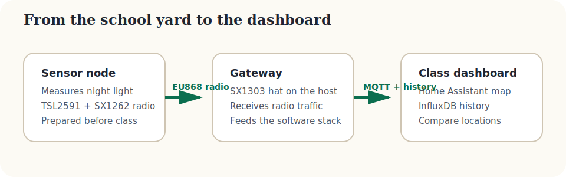
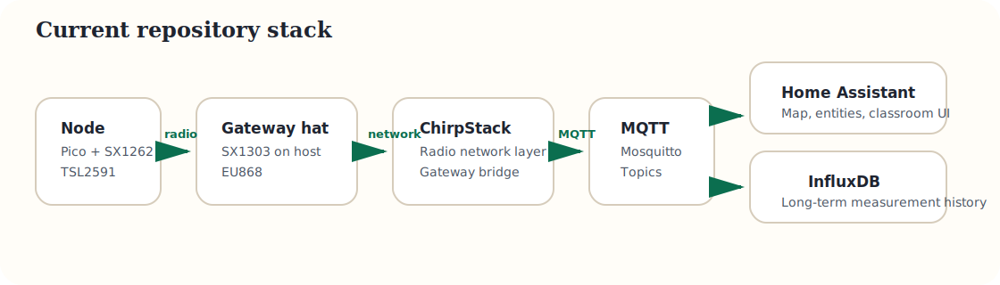

# Project Architecture

## Classroom view

{: .lp-diagram }

The core flow is simple:

1. A sensor node measures light.
2. Radio sends the measurement to the gateway.
3. The gateway forwards data into the software stack.
4. Home Assistant shows the map and InfluxDB keeps the history.

## Real technical stack

{: .lp-diagram }

The Docker stack in this repository contains:

- ChirpStack for the radio network layer.
- ChirpStack Gateway Bridge for Semtech UDP ingestion on port `1700`.
- Mosquitto for MQTT transport.
- Home Assistant for the classroom dashboard.
- InfluxDB for long-term history.

The SX1303 concentrator itself is not controlled by Docker in the current design. A packet forwarder still runs on the Raspberry Pi host and forwards traffic into the stack.

## Useful classroom payload

```json
{
  "name": "school-yard-01",
  "latitude": 48.2167,
  "longitude": -1.6986,
  "lux": 123,
  "ts": 1690000000,
  "charger_type": "CN3065",
  "charger_status": "unknown"
}
```

## Design choices after the review

- One default radio region: EU868.
- One main light sensor: TSL2591X.
- One simple student workflow: pre-flashed kits.
- One recommended gateway path: host machine plus SX1303 868 MHz hat.
- One current gateway validation path: host-side Semtech UDP forwarder pointed at `chirpstack-gateway-bridge`.

## Known boundary

<div class="lp-note">
  <p>The Pico node firmware now implements OTAA LoRaWAN on the node side and aligns with the ChirpStack server path shipped in this repository.</p>
  <p>The repository stack already includes the server-side bridge, but the Raspberry Pi gateway still needs its own host-side forwarder setup.</p>
  <p>The Pi Zero 2W plus SX1262 hat variant remains a future hardware option and still needs its own software adaptation plus regulated 5 V power.</p>
</div>

See the dedicated [Gateway validation guide]({{ site.baseurl }}) for the practical Raspberry Pi bring-up path.
