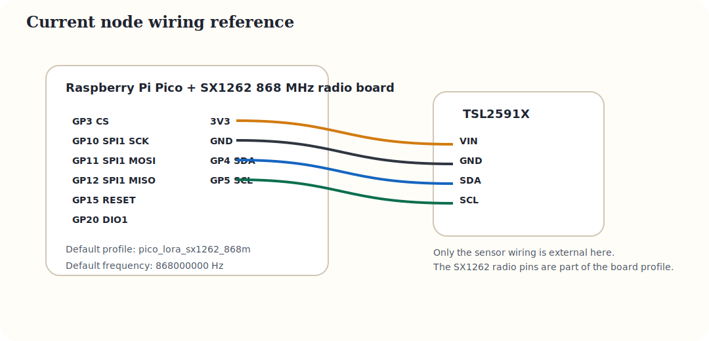
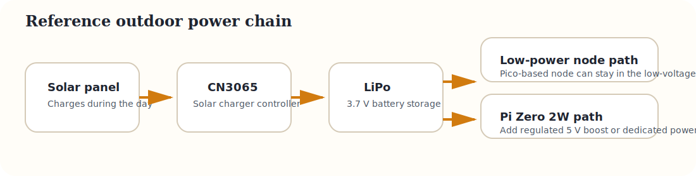

# Current Sensor Node Assembly

This page describes the path that is coherent with the firmware in this repository today: a pre-flashed sensor node based on Raspberry Pi Pico and an SX1262 radio in EU868.

{: .lp-diagram }

## Wiring reference

### SX1262 radio bus

- Default profile: `pico_lora_sx1262_868m`
- SPI1: `GP10` SCK, `GP11` MOSI, `GP12` MISO
- Radio control: `GP3` CS, `GP15` RESET, `GP2` BUSY, `GP20` DIO1
- Default frequency: `868000000`

### TSL2591X sensor

- `3V3` to `VIN`
- `GND` to `GND`
- `GP4` to `SDA`
- `GP5` to `SCL`

## Power chain

{: .lp-diagram }

- Bench tests: USB power on the Pico.
- Outdoor target: solar panel into CN3065, then LiPo battery, then the low-power node.
- If the future Pi Zero 2W node is adopted, add a regulated 5 V converter between the battery and the computer.
