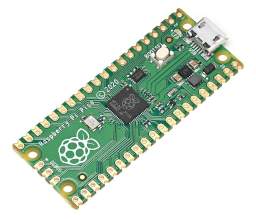
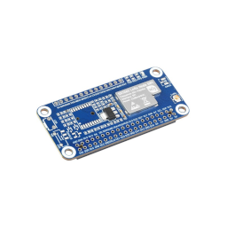
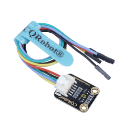
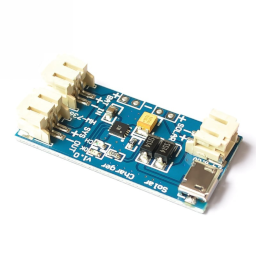
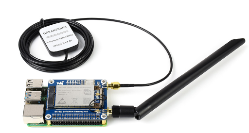

## Bill of Materials
You’ll [assemble]({{ site.baseurl }}) the following:
- Raspberry Pi Pico
- LoRa module (SX1262 Pico HAT, or SX127x)
- Light sensor (TSL2591, TEMT6000, or BH1750)
- Li‑Po battery + charger (CN3065, MCP73871, or TP4056)
- 3.3 V regulator, decoupling caps
- JST XMX 2.54mm and/or PH 2.0mm cables, or Dupont
- Enclosure

## Gateway (Raspberry Pi)
- LoRa concentrator (Waveshare SX1303 HAT or SX1302/1303 USB stick).
- Mosquitto + ChirpStack + Home Assistant + InfluxDB (docker-compose provided).

## Tips
- Keep SPI traces short for the LoRa module.
- Common ground and nearby decoupling for sensors and radio.
- Use connectors to swap sensors or LoRa modules easily.
