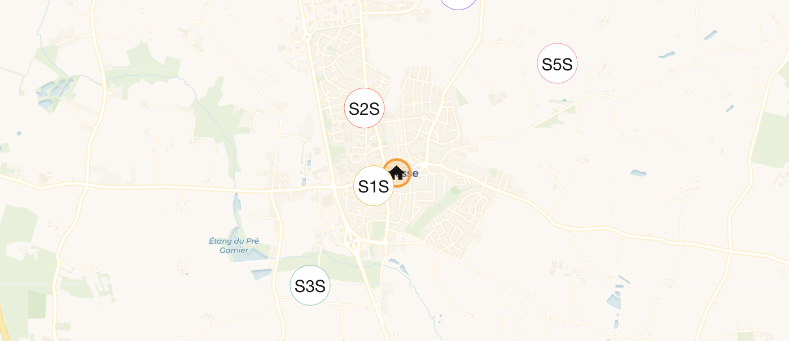

## Overview
* **Goal** – Build a network of small, autonomous *Light‑Pollution Monitors* that collect night‑time lux data, upload to Home Assistant, and show the results on a map.
* **Audience** – 12‑14 year old students in teams.
* **Why it matters** – Light pollution harms ecosystems, disturbs sleep, and hides the stars. Measuring it teaches data, networking, and environmental stewardship.

## Deliverables
1) Hardware kit (Pico + light sensor + LoRa + battery)  
2) Assembly guide  
3) MicroPython firmware (`src/firmware`)  
4) Docker server stack (HA + Mosquitto + LoRa-MQTT + InfluxDB)  
5) Clear docs for teachers and kids.

## Classroom flow
1. Form teams, assemble, flash firmware.  
2. Configure name/location with `SETUP.PY`.  
3. Deploy outdoors.  
4. View HA map + InfluxDB history.  
5. Discuss results and light-pollution mitigation.
