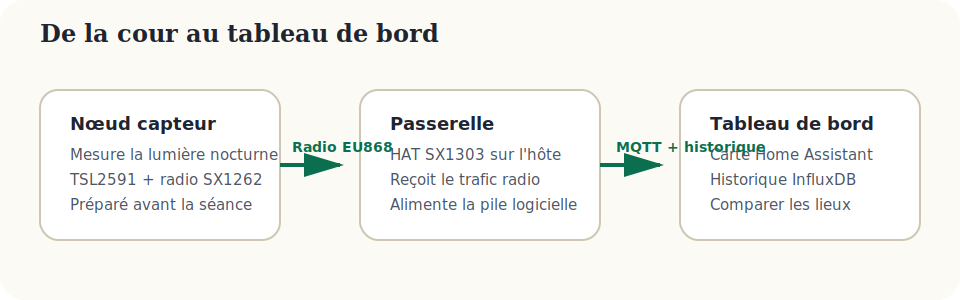
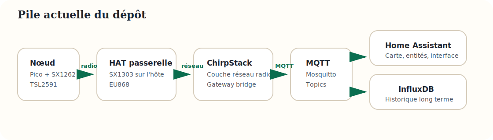

# Architecture du projet

## Vue pédagogique

{: .lp-diagram }

Le principe est simple :

1. Un nœud capteur mesure la lumière.
2. La radio envoie la mesure vers la passerelle.
3. La passerelle publie les données dans la pile logicielle.
4. Home Assistant affiche la carte et InfluxDB garde l’historique.

## Chaîne technique réelle

{: .lp-diagram }

La pile Docker du dépôt comprend :

- ChirpStack pour la couche réseau radio.
- ChirpStack Gateway Bridge pour l’ingestion Semtech UDP sur le port `1700`.
- Mosquitto pour le transport MQTT.
- Home Assistant pour l’affichage et l’exploitation pédagogique.
- InfluxDB pour conserver l’historique complet.

Le concentrateur SX1303 lui-même n’est pas piloté par Docker dans la conception actuelle. Un packet forwarder doit encore tourner sur l’hôte Raspberry Pi pour injecter le trafic dans la pile.

## Modèle de données utile en classe

```json
{
  "name": "college-cour-01",
  "latitude": 48.2167,
  "longitude": -1.6986,
  "lux": 123,
  "ts": 1690000000,
  "charger_type": "CN3065",
  "charger_status": "unknown"
}
```

## Choix de référence après révision

- Une seule bande radio par défaut : EU868.
- Un seul capteur mis en avant : TSL2591X.
- Un seul chemin simple pour les élèves : kits pré-flashés.
- Une seule passerelle recommandée : machine hôte + HAT SX1303 868 MHz.
- Un seul chemin de validation de passerelle aujourd’hui : packet forwarder Semtech UDP côté hôte vers `chirpstack-gateway-bridge`.

## Limite connue assumée

<div class="lp-note">
  <p>Le firmware du nœud Pico prend désormais en charge le LoRaWAN OTAA côté nœud et s’aligne avec la chaîne ChirpStack du dépôt.</p>
  <p>La pile du dépôt inclut déjà le bridge côté serveur, mais la passerelle Raspberry Pi a encore besoin de sa configuration de forwarder côté hôte.</p>
  <p>La variante Pi Zero 2W avec HAT SX1262 reste une évolution matérielle future : elle demandera une adaptation logicielle spécifique et une alimentation 5 V régulée.</p>
</div>

Le chemin pratique de mise en service est détaillé dans le [guide de validation de la passerelle]({{ site.baseurl }}).
