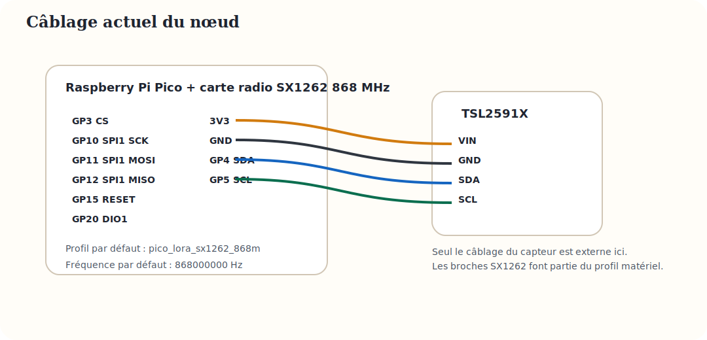
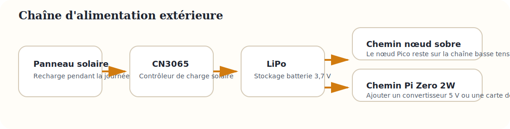

# Montage du nœud capteur actuel

Cette page décrit le chemin actuellement cohérent avec le firmware du dépôt : un nœud pré-flashé basé sur Raspberry Pi Pico et radio SX1262 en 868 MHz.

{: .lp-diagram }

## Référence de câblage

### Bus radio SX1262

- Profil par défaut : `pico_lora_sx1262_868m`
- SPI1 : `GP10` SCK, `GP11` MOSI, `GP12` MISO
- Contrôle radio : `GP3` CS, `GP15` RESET, `GP2` BUSY, `GP20` DIO1
- Fréquence par défaut : `868000000`

### Capteur TSL2591X

- `3V3` vers `VIN`
- `GND` vers `GND`
- `GP4` vers `SDA`
- `GP5` vers `SCL`

## Chaîne d’alimentation

{: .lp-diagram }

- Banc de test : alimentation USB du Pico.
- Version extérieure visée : panneau solaire vers CN3065, puis batterie LiPo, puis nœud basse consommation.
- Si la prochaine variante Pi Zero 2W est retenue, ajouter un convertisseur 5 V régulé entre la batterie et le calculateur.

## Pourquoi ce montage est privilégié

- Le dépôt contient déjà le firmware correspondant.
- Le profil radio est maintenant cohérent avec EU868.
- Le TSL2591X est simple à câbler en I²C.
- Les kits peuvent être pré-flashés puis confiés rapidement aux élèves.
