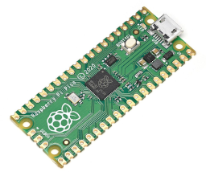
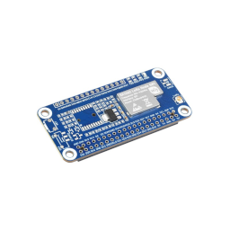
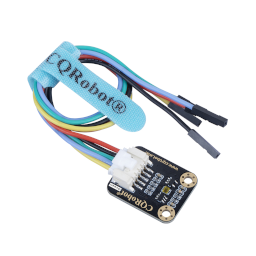
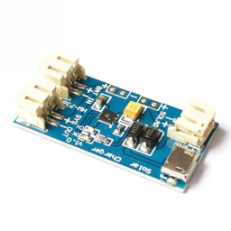
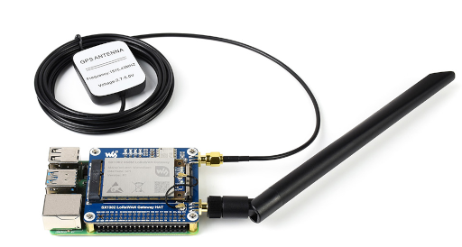

# Matériel de référence

## Profil actuel supporté dans le dépôt

| Élément | Référence pratique | Statut |
|--------|--------------------|--------|
| Microcontrôleur du nœud | Raspberry Pi Pico | Support logiciel actuel |
| Radio du nœud | Waveshare Pico-LoRa-SX1262-868M | Profil firmware par défaut |
| Capteur de lumière | TSL2591X | Supporté |
| Charge solaire | CN3065 + panneau + LiPo 3,7 V | Documenté comme chaîne d’alimentation |
| Passerelle | Raspberry Pi 4/5 ou LattePanda v1 + SX1303 868 MHz | Cible recommandée |

## Pièces achetées pour la prochaine activité

- HAT passerelle SX1303 868 MHz pour Raspberry Pi.
- HAT SX1262 868 MHz.
- Capteurs TSL2591X.
- Chargeurs solaires CN3065.
- Panneaux solaires adaptés.
- Batteries LiPo 3,7 V.
- Raspberry Pi Zero 2W.

## Ce que cela change dans la documentation

- La documentation s’aligne désormais sur une bande radio unique : EU868.
- Le capteur de lumière de référence devient le TSL2591X.
- Le couple solaire CN3065 + LiPo devient la chaîne d’alimentation visée pour les nœuds basse consommation.
- La variante Pi Zero 2W est signalée comme évolution matérielle, pas comme chemin déjà implémenté.

## Attention à l’alimentation

  
Le Raspberry Pi Pico peut fonctionner dans une chaîne basse consommation plus simple qu’un Pi Zero 2W.

  
Le Pi Zero 2W demande une alimentation 5 V régulée. Une LiPo 3,7 V et une carte CN3065 ne suffisent pas seules : il faut ajouter un étage d’élévation ou une carte d’alimentation adaptée.

## Images utiles

