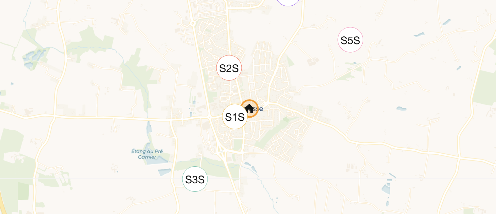

# Atelier pollution lumineuse

  

    
Collège 5e à 3e

    <h2>Mesurer la nuit, lire une carte, discuter de l’impact de l’éclairage sur le vivant et sur le ciel.</h2>
    
Le projet s’appuie sur des kits pré-flashés pour que les élèves passent du temps sur l’observation, la comparaison des lieux et l’interprétation des données, pas sur le dépannage logiciel.

    

      <a class="lp-button" href="{{ site.baseurl }}">Parcours élèves</a>
      <a class="lp-button lp-button--secondary" href="{{ site.baseurl }}">Préparer l’atelier</a>
    

  

  

    <h3>Ce que l’on apprend</h3>
    
Données environnementales, réseau radio, cartographie, énergie autonome et esprit critique face aux mesures.

    <h3>Ce que les élèves manipulent</h3>
    
Un nœud capteur, une carte Home Assistant, des mesures de lux, puis un court compte rendu.

  

## Démarrer vite

  

    <h3>Élèves</h3>
    
Suivre l’activité en classe, poser le capteur, relever les résultats et comparer les zones.

    
<a href="{{ site.baseurl }}">Ouvrir le parcours élèves</a>

  

  

    <h3>Enseignants</h3>
    
Préparer la passerelle, nommer les kits, configurer les coordonnées et organiser la séance.

    
<a href="{{ site.baseurl }}">Ouvrir le guide enseignant</a>

  

  

    <h3>Matériel</h3>
    
Voir le kit de référence actuel, les pièces achetées pour la prochaine activité et les contraintes d’alimentation.

    
<a href="{{ site.baseurl }}">Voir le matériel</a>

  

  

    <h3>Architecture</h3>
    
Comprendre la chaîne radio, ChirpStack, MQTT, Home Assistant et InfluxDB.

    
<a href="{{ site.baseurl }}">Voir l’architecture</a>

  

## Position actuelle du dépôt

  
<strong>Chemin implémenté aujourd’hui :</strong> nœud capteur basé sur un Raspberry Pi Pico avec radio SX1262 en 868 MHz, capteur TSL2591 et kit pré-configuré.

  
<strong>Chemin protocolaire implémenté aujourd’hui :</strong> le firmware Pico rejoint maintenant ChirpStack en LoRaWAN OTAA et envoie les mesures chiffrées comme charges utiles applicatives.

  
<strong>Chemin matériel suivant :</strong> passerelle Raspberry Pi 4/5 ou LattePanda v1 avec HAT SX1303 868 MHz, et expérimentation d’un nœud Pi Zero 2W avec une alimentation 5 V adaptée.

## Livrables utiles

- Documentation bilingue pour l’atelier et le support technique.
- Pile serveur Docker avec ChirpStack, Mosquitto, Home Assistant et InfluxDB.
- Firmware MicroPython pour les kits pré-flashés actuels.
- Guide de montage et diagrammes pour préparer une séance plus lisible que la sortie GitHub Pages d’origine.
